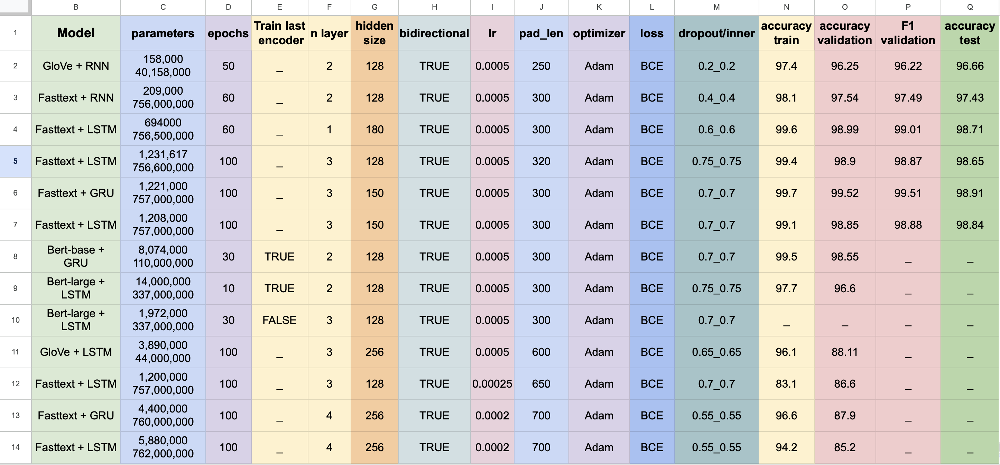

# Rumour Detection with PyTorch

Welcome to the Rumour Detection repository! This project focuses on implementing and exploring various configurations for rumour detection using PyTorch. The repository not only includes the PyTorch implementation of the classification models but also features an intuitive interface for easily tuning, testing different training configurations, and adapting preprocessing steps. 

Here are some results of training models using this interface.


[](https://docs.google.com/spreadsheets/d/1HSW92__FzxiRzxJaF7wNpTlthKCVXSMhCuj72LsNzPo/edit?usp=sharing)


## Key Features

- **PyTorch Implementation:** The core of this project is robust rumour detection models built with PyTorch, offering a powerful and flexible framework for training and evaluation.

- **Configurable Interface:** An easy-to-use interface allows users to tune different aspects of the training process using a `config.ini` file. This empowers users to experiment with various hyperparameters and configurations effortlessly.

- **Google Sheet Reporting:** Some of the results of model training experiments that are accompanied by a clear overview of model performance under different settings, are reported to this [**Google Sheet**](https://docs.google.com/spreadsheets/d/1HSW92__FzxiRzxJaF7wNpTlthKCVXSMhCuj72LsNzPo/edit?usp=sharing). Needless to say, all of the reported models were trained just by editing `config.ini` file.


- **Downloadable Models:** Some of the Pre-trained models, resulting from experiments with various hyperparameters, are available for download in the provided google sheet. These models can be directly applied or serve as a starting point for further fine-tuning.

## Getting Started

### Installation

Clone the repository to your local machine or Google colab:

```bash
!git https://github.com/E-Ghafour/RumourDetection.git
!cd RumourDetection
!pip install -r requirements.txt
```

### Usage

  **Configuring Training:**
  
-   Download rumour detection data from provided google sheet and set the train and test path in `config.ini` file.
-   Open the `config.ini` file to adjust hyperparameters and training configurations.
-   Description about tuning the hyperparameters

  Parameter                | Value                 | Description                                           | Possible Values                              |
|--------------------------|-----------------------|-------------------------------------------------------|----------------------------------------------------|
| type                     | LSTM                   | Type of the model (Recurrent Neural Network)         | LSTM, GRU, RNN.                   |
| input_size               | 768                   | Size of the output layer of the embedding             |                                                     |
| hidden_size              | 128                   | Size of the hidden layer                              | Any positive integer                                |
| output_size              | 1                     | for binary classification like Rumour Detection should be 1| Any positive integer                                |
| learning_rate            | 0.0005                | Learning rate for optimization                        | Any positive float                                  |
| batch_size               | 128                   | Number of input samples used in each iteration       | Any positive integer                                |
| n_layer                  | 3                     | Number of recurrent layers                            | Any positive integer                                |
| bidirectional           | True                  | Whether the RNN is bidirectional or not               | True, False                                        |
| inner_dropout           | 0.5                   | Dropout rate within the RNN layers                    | Any float between 0 and 1                           |
| dropout                  | 0.4                   | Dropout rate applied to the RNN output                | Any float between 0 and 1                           |
| epochs                   | 50                     | Number of training epochs                             | Any positive integer                                |
| pad_len                  | 250                   | Padding length for input sequences                    | Any positive integer                                |
| trainable_embedding      | False                 | Whether the embedding layer is trainable              | True, False                                        |
| embedding_type           | bert                  | Type of embedding used (BERT in this case)            | bert, glove, fasttext.                              |
| validation_size          | 0.15                  | Size of the validation set as a percentage of the data| Any float between 0 and 1                           |
| trainable_last_encoder   | False                 | Whether the last layer of the encoder is trainable    | True, False                                        |
| bert_type                | bert-base-uncased     | Type of BERT model used(if the embedding_type is bert) | bert-base-cased, bert-large-uncased, etc.          |


 **Training a Model:**
    
```bash
!python train.py
```        
